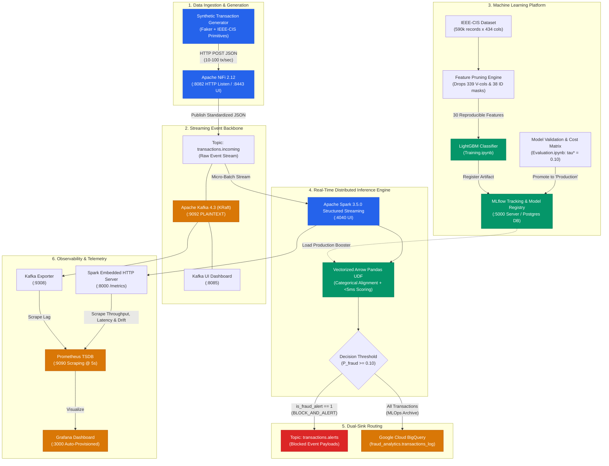
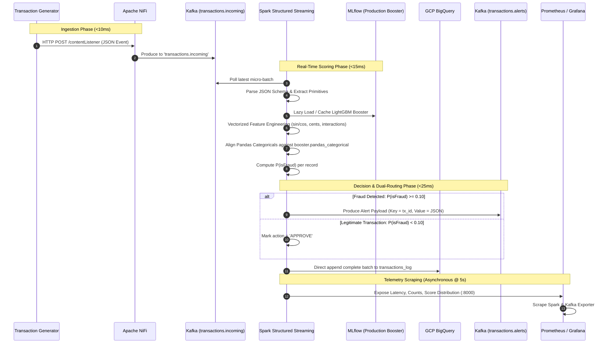
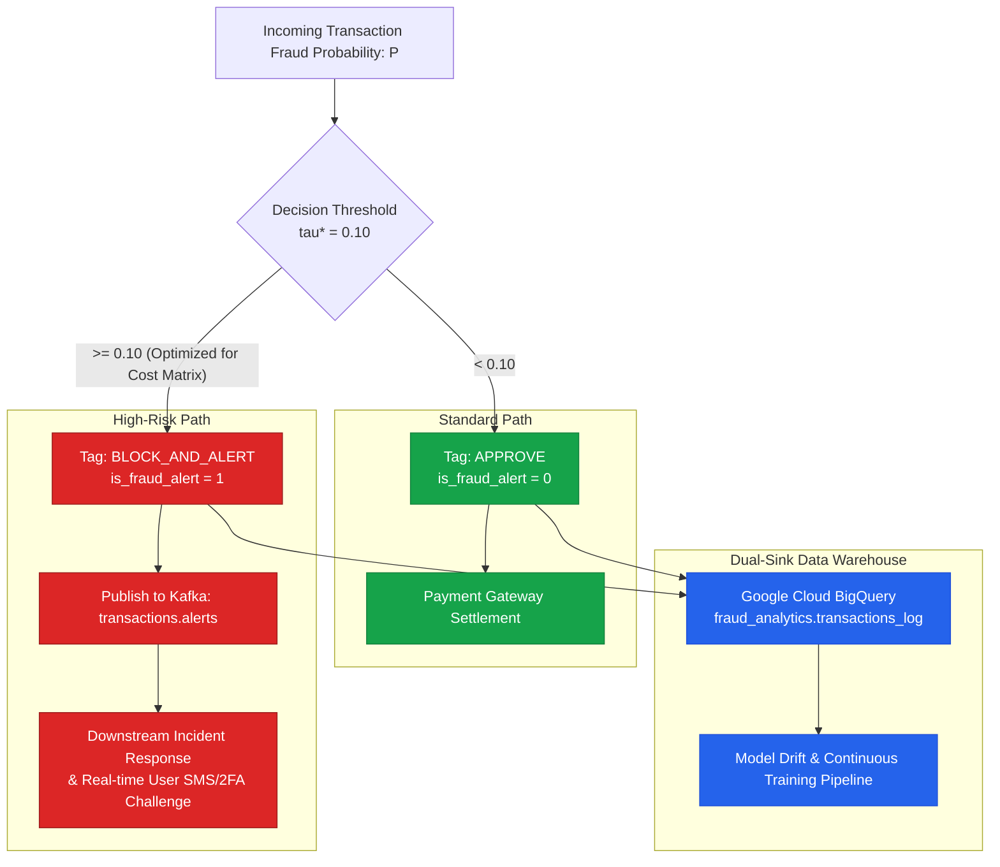
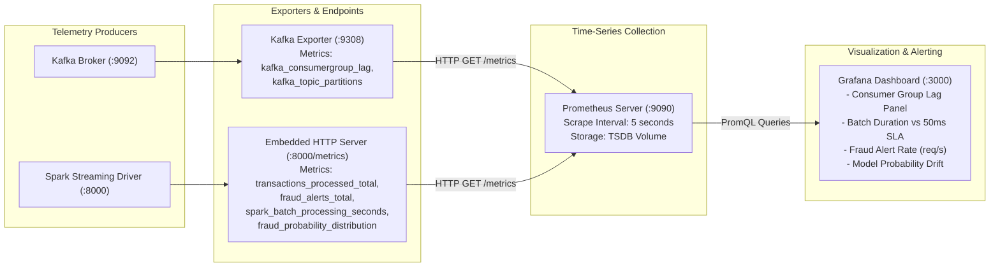
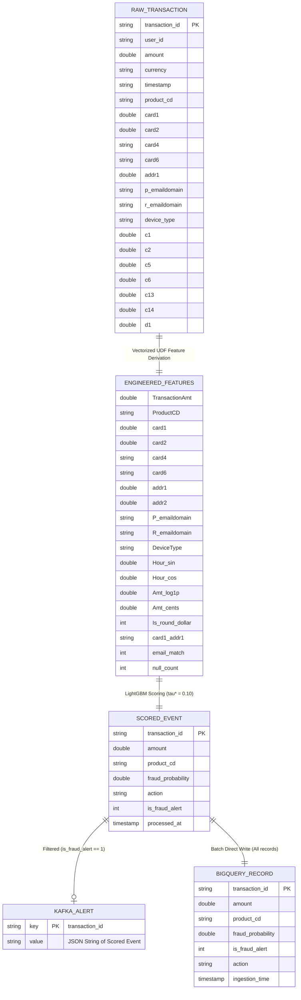

# System Architecture & Pipeline Diagrams

This document contains architectural diagrams and technical flowcharts for the **Real-Time Fraud Prevention & Intelligent Analytics Engine**.

---

## 1. End-to-End System Architecture

---

## 2. Real-Time Transaction Lifecycle Sequence

---

## 3. Offline Feature Selection & Online Parity Pipeline

```mermaid
flowchart LR
    subgraph RAW["Raw IEEE-CIS Dataset"]
        R1["590,540 Transactions"]
        R2["434 Raw Features"]
        R3["339 Proprietary V1-V339 Features"]
        R4["38 Obscured id_01 - id_38 Masks"]
    end

    subgraph PRUNING["Feature Pruning (Anti-Pattern Elimination)"]
        DROP["Drop V-columns & id-masks<br/>(Cannot calculate in real-time under 50ms)"]
        RETAIN["Retain Primitives:<br/>Amt, ProductCD, card1-6, addr1-2,<br/>P/R_emaildomain, DeviceType, C1-14, D1"]
    end

    subgraph ENG["Reproducible Feature Engineering (30 Features)"]
        F1["Cyclical Temporal:<br/>Hour_sin, Hour_cos, Hour_of_Day, Day_of_Week"]
        F2["Monetary Transforms:<br/>Amt_log1p, Amt_cents, Is_round_dollar"]
        F3["Entity Interaction:<br/>card1_addr1 (Composite String)"]
        F4["Domain Match:<br/>email_match (P == R)"]
        F5["Categorical Columns (7):<br/>Exact pandas Category Dtypes"]
    end

    subgraph PARITY["Online Streaming Parity"]
        STREAM["Spark Vectorized Pandas UDF"]
        CATEGORIES["Enforce booster.pandas_categorical<br/>(Unknown categories mapped to NaN)"]
        MODEL["LightGBM Booster Inference<br/>(P99 < 5ms)"]
    end

    RAW --> PRUNING
    R3 -.->|"Destroy Streaming Latency"| DROP
    R4 -.->|"Non-Reproducible"| DROP
    PRUNING --> RETAIN
    RETAIN --> ENG
    ENG -->|"train_features.parquet"| STREAM
    STREAM --> CATEGORIES
    CATEGORIES --> MODEL
```

---

## 4. Decision Boundary & Financial Cost-Matrix Optimization

---

## 5. Observability & Telemetry Scrape Topology

---

## 6. Data Entity Relationship & Schema Mapping

