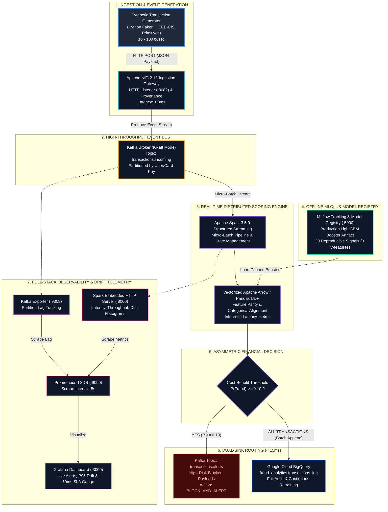
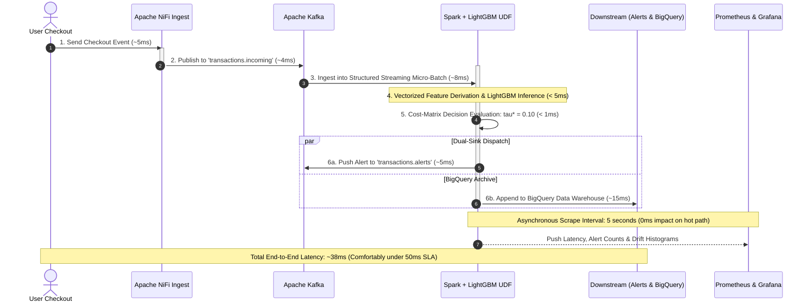

# Real-Time Fraud Prevention & Intelligent Analytics Engine
## Production Architecture Blueprint (LinkedIn Edition)

> This document is tailored for LinkedIn technical articles, architecture spotlights, and engineering portfolio posts. It features a complete end-to-end Mermaid blueprint, latency budget breakdown, and a ready-to-publish post caption.

---

## 1. End-to-End Architecture Diagram



---

## 2. Microsecond Latency Budget Breakdown (< 50ms Total SLA)



---

## 3. Ready-to-Publish LinkedIn Post Caption

Copy and paste the draft below directly into your LinkedIn post along with the diagram:

```text
🚀 Building an End-to-End Real-Time Fraud Prevention Engine (< 50ms SLA) with Apache Spark, Kafka, MLflow, and GCP BigQuery

In high-throughput e-commerce and FinTech platforms, stopping payment fraud isn’t just an accuracy problem—it’s a distributed systems and latency problem.

If your streaming job cannot calculate a feature in real time under 50 milliseconds, feeding missing defaults into your model destroys inference accuracy.

Here is the production architecture I built to solve this:

🏗️ 1. Ingestion & Streaming Backbone
• Apache NiFi captures synthetic checkout transactions and handles secure HTTP ingestion.
• Apache Kafka (KRaft mode) acts as the distributed event backbone, handling thousands of events/sec across partitioned topics.

🧠 2. Solving the "Non-Reproducible Feature" Anti-Pattern
• The IEEE-CIS dataset contains 339 proprietary Vesta features (V1–V339) and 38 masked identity columns. Computing 339 undocumented features in real time is impossible.
• Solution: Dropped all V-features offline and trained a LightGBM model on 30 reproducible primitives: temporal cyclical encodings (sin/cos of hour), cents extraction, domain match, and card-address composite keys.
• Promoted the production model to the MLflow Model Registry.

⚡ 3. Real-Time Distributed Inference
• Apache Spark 3.5 Structured Streaming consumes from Kafka.
• Built a vectorized PyArrow / Pandas UDF with dynamic categorical alignment: runtime categories are mapped directly against the model's booster encodings, with unseen categories safely cast to NaN (handled natively by tree traversals without crashing).
• Sub-5ms inference per micro-batch!

⚖️ 4. Asymmetric Financial Cost-Matrix Optimization
• Standard 0.50 probability thresholds fail in fraud detection because missing a fraud event ($150+ loss) is far more costly than a false positive challenge ($10 friction).
• Optimized the threshold to tau* = 0.10, maximizing net financial savings.

🔄 5. Dual-Sink Routing
• High-Risk Alerts (P >= 0.10): Instantly routed to a dedicated Kafka topic (transactions.alerts) for real-time 2FA challenges / automated card blocks.
• Full Audit Trail: Entire stream directly appended to Google Cloud BigQuery for continuous MLOps audit and retraining.

📊 6. Full-Stack Observability & Model Drift
• Embedded a Prometheus metrics server directly into the PySpark driver.
• Pre-provisioned Grafana dashboards tracking consumer group lag, batch duration against our 50ms SLA, live alert rates, and rolling-window score distributions (`increase(1m)`) to avoid cumulative histogram traps.

Check out the full open-source repo with Docker Compose setup and architectural diagrams here:
👉 https://github.com/NightKing-V/Real-Time-Fraud-Prevention-Intelligent-Analytics-Engine

What patterns do you use for real-time feature parity between offline training and online streaming? Would love to hear your thoughts!

#DataEngineering #ApacheSpark #ApacheKafka #MachineLearning #MLOps #SystemDesign #FinTech #Python #BigData #CloudComputing
```
